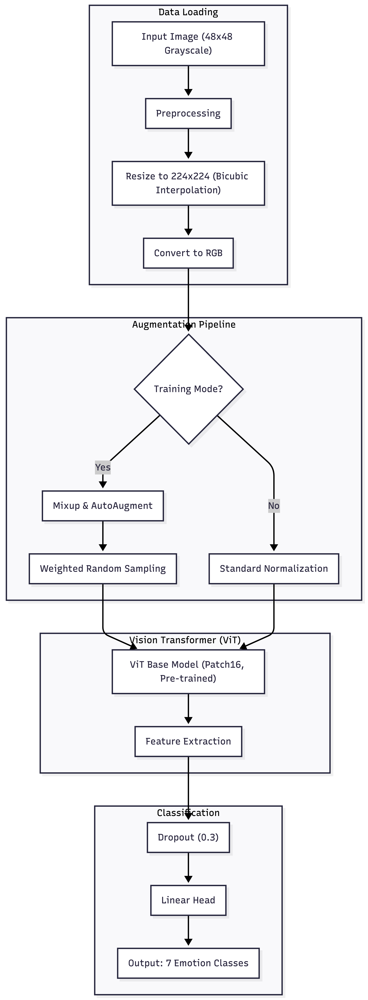

# ASPICV Project - Facial Emotion Recognition

## Overview
This project implements a high-performance Facial Emotion Recognition (FER) system using a dataset of 3,000 grayscale images (48x48 pixels).

The dataset consists of:
*   **3,000 Total Images**: Numbered `1.jpg` to `3000.jpg`.
*   **2,700 Training Images**: Labeled in `train.csv`.
*   **300 Test Images**: The target set for our predictions.

### Data Structure
The `train.csv` file contains:
*   `id`: Image index (e.g., `1` for `1.jpg`).
*   `label`: Emotion class (`happy`, `sad`, `angry`, `neutral`, `fear`, `surprise`, `disgust`).

## Project Objective
The goal is to develop a robust system for facial expression classification. We chose a modern architecture based on **Vision Transformers (ViT)**, demonstrating the effectiveness of state-of-the-art models even on low-resolution imagery.

## System Architecture & Workflow

Below is the processing flow designed for this project:



## Proposed Solution

### Architecture
We utilized the `google/vit-base-patch16-224` model, pre-trained on ImageNet-21k.
*   **Why ViT?** Vision Transformers capture global relationships between image patches, making them highly effective at distinguishing subtle facial features compared to traditional CNNs with limited receptive fields.
*   **Input Adaptation**: Original 48x48 images are upscaled to 224x224 to meet the transformer's input requirements.
*   **Custom Classifier**: Replaced the original head with a custom linear layer adapted for our 7 emotion classes, using **Dropout (0.3)** for regularization.

### Optimization & Advanced Techniques
1.  **Data Augmentation (Mixup & Geometric)**:
    *   Implemented **Mixup** (`alpha=0.4`) which blends pairs of images and their labels. This forces the model to learn linear interpolations between features, significantly improving robustness.
    *   Geometric transforms: RandomHorizontalFlip, RandomRotation, and RandomAffine.
2.  **Label Smoothing (0.1)**:
    *   Prevents the model from becoming over-confident in incorrect predictions by distributing a small probability mass to non-target classes.
3.  **Balanced Sampling**:
    *   Used a `WeightedRandomSampler` to address class imbalance (e.g., the "disgust" class has very few samples), ensuring every training batch has a balanced distribution of emotions.
4.  **Training Optimizations**:
    *   **MPS Acceleration**: Fully utilizes Apple Silicone (M1/M2/M3) Metal Performance Shaders.
    *   **Mixed Precision**: FP16 training for reduced memory usage and faster computation.
    *   **Scheduler**: `ReduceLROnPlateau` automatically adjusts the learning rate when validation performance stalls.
5.  **Test Time Augmentation (TTA)**:
    *   During inference, each test image is processed multiple times (original, flipped, slightly zoomed). The model averages these predictions to produce a highly reliable final classification.

---

## Usage Instructions

### 1. Training & Prediction
The main script `app.py` handles the entire pipeline: loading data, training, saving the model, and generating predictions.

```bash
python3 app.py
```

### 2. Interactive Visualization
We built a Streamlit application to demonstrate the model in real-time and visualize prediction confidence.

```bash
streamlit run streamlit_app.py
```

## Installation & Setup

### Local Development

1.  **Clone the repository**:
    ```bash
    git clone <repository_url>
    cd aspicv-project
    ```

2.  **Create a virtual environment**:
    ```bash
    python3 -m venv .venv
    source .venv/bin/activate  # On Windows: .venv\Scripts\activate
    ```

3.  **Install dependencies**:
    ```bash
    pip3 install -r requirements.txt
    ```

### Docker Usage

You can run the entire project using Docker Compose, without worrying about local dependencies.

1.  **Build and run**:
    ```bash
    docker-compose up --build
    ```
    This will start:
    *   **`backend`** (ex-training): Runs the `app.py` script to train the model.
    *   **`frontend`** (ex-dashboard): Starts the Streamlit app.

2.  **Access the Frontend**:
    Open [http://localhost:8501](http://localhost:8501) in your browser.

3.  **Run specific services**:
    *   To run only the dashboard: `docker-compose up frontend`
    *   To run only training: `docker-compose up backend`

---

## Project Structure

```text
aspicv-project/
├── app.py                  # Main script (Training + Inference)
├── streamlit_app.py        # Interactive Demo App
├── config/
│   └── settings.py         # Centralized Configuration
├── utils/                  # Utilities
├── dataset/                # Image Data
├── models/                 # Saved Models (.pt)
├── logs/                   # Training Logs
├── submission.csv          # Challenge Output File
└── README.md               # Project Documentation
```

## Dependencies
*   Python 3.9+
*   PyTorch, torchvision
*   Transformers (Hugging Face)
*   Pandas, NumPy, Pillow
*   Streamlit, Tqdm, Scikit-learn
